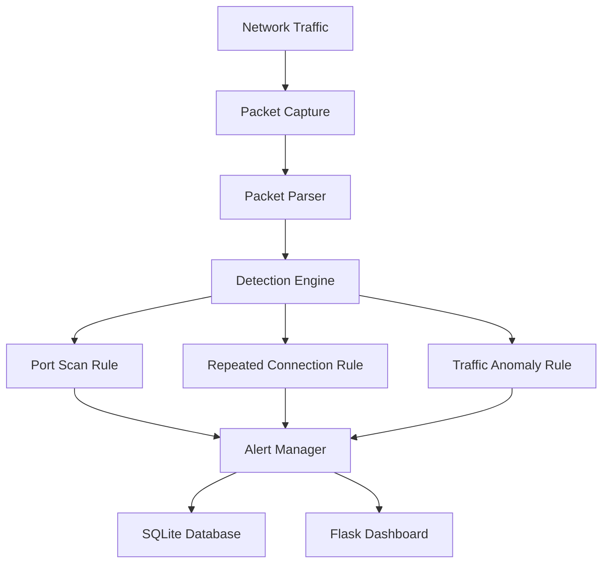

# Network Intrusion Detection System (NIDS)

A Python-based Network Intrusion Detection System designed for educational, portfolio, and interview demonstrations in a controlled environment. The project captures packets, normalizes them into a structured event model, applies explainable detection rules, persists alerts in SQLite, and exposes a small Flask dashboard.

## Features

- Packet capture and parsing for TCP, UDP, and ICMP traffic
- Normalized event model for downstream detection
- Port scan detection based on unique destination ports within a time window
- Repeated connection detection for brute-force-like bursts to a single service
- Simple traffic anomaly detection based on recent baselines
- SQLite-backed alert persistence
- Flask dashboard for recent alerts and summary statistics
- Docker-based isolated test lab for safe reproducible scenarios
- Automated tests with pytest

## Architecture



## Repository Structure

```text
network-ids/
├── dashboard/
│   ├── app.py
│   └── templates/
│       └── index.html
├── lab/
│   ├── docker-compose.yml
│   └── traffic_generator.py
├── rules/
│   ├── anomaly.py
│   ├── brute_force.py
│   └── port_scan.py
├── src/
│   ├── alerts.py
│   ├── capture.py
│   ├── config.py
│   ├── database.py
│   ├── detector.py
│   ├── engine.py
│   ├── models.py
│   └── parser.py
├── tests/
│   ├── conftest.py
│   ├── test_detectors.py
│   └── test_parser.py
├── .gitignore
├── pytest.ini
├── requirements.txt
├── README.md
└── data/
```

## Installation

```bash
python3 -m venv .venv
. .venv/bin/activate
python -m pip install --upgrade pip
python -m pip install -r requirements.txt
```

## Usage

### Run the detection engine

```bash
python - <<'PY'
from src.engine import NetworkIDS

ids = NetworkIDS()
ids.process_event({
    'timestamp': '2024-01-01T00:00:00Z',
    'src_ip': '10.0.0.7',
    'dst_ip': '10.0.0.9',
    'src_port': 41000,
    'dst_port': 22,
    'protocol': 'TCP',
    'tcp_flags': 'SYN',
    'packet_length': 60,
})
print(ids.recent_alerts())
ids.close()
PY
```

### Run the dashboard

```bash
export FLASK_APP=dashboard.app
flask run --host 127.0.0.1 --port 5000
```

Then open http://127.0.0.1:5000.

## Running the Docker Security Lab

Docker Compose isolates a monitored target and a traffic generator within a private network.

```bash
docker compose -f lab/docker-compose.yml up --build
```

Useful lab commands:

```bash
docker compose -f lab/docker-compose.yml run traffic-generator normal
docker compose -f lab/docker-compose.yml run traffic-generator scan
docker compose -f lab/docker-compose.yml run traffic-generator bruteforce
```

The lab only communicates within the Compose network and does not send traffic outside the environment.

## Detection Rules

### Port scan detection

The detector tracks unique destination ports contacted by each source IP inside a configurable time window. If the count exceeds the configured threshold, it raises a `PORT_SCAN` alert.

Rationale: a single service with a short burst is normal; a single source contacting many ports quickly is often a sign of reconnaissance.

### Repeated connection detection

The detector counts connection attempts from a source to the same destination IP and port in a fixed time window. If the count is unusually high, it raises a `REPEATED_CONNECTION` alert.

Rationale: bursts to the same service can indicate credential guessing or script-driven probing.

### Traffic anomaly detection

The anomaly detector compares current traffic to the recent baseline for the same target. It triggers when current events exceed a multiplier of the baseline or when the count surpasses a configured minimum.

Rationale: this identifies sudden spikes without requiring an ML model or opaque statistical assumptions.

## Example Alerts

```text
PORT_SCAN | HIGH | 14:32:10 | 192.168.1.20 -> 192.168.1.30 | 32 ports / 10 sec
REPEATED_CONNECTION | HIGH | 14:33:12 | 10.0.0.7 -> 10.0.0.9:22 | 8 connections / 15 sec
TRAFFIC_ANOMALY | MEDIUM | 14:35:00 | multiple -> 10.0.0.5 | 18 events / 30 sec
```

## Testing

```bash
pytest -q
```

The suite covers parser behavior, detector thresholds, alert generation, and database usage.

## False-Positive Considerations

- Port scan detectors may flag overly broad but legitimate service discovery from internal tooling.
- Repeated connection detection can trigger during backup jobs or health checks.
- Traffic anomalies can overreact to internal batch jobs or sudden bursts from legitimate automation.

Thresholds should be tuned to the specific network profile and environment.

## Limitations

- This is a rule-based detection system, not a full enterprise IDS.
- It does not inspect payload content or perform deep protocol decoding beyond basic TCP, UDP, and ICMP parsing.
- The lab intentionally uses simple network generation, not a full attack suite.
- Packet capture depends on the host environment and interface availability.

## Future Improvements

- Add packet payload inspection and protocol validation
- Add rate-limited real-time streaming into the database
- Expand rule coverage for SYN floods and DNS abuse
- Add authentication and access control to the dashboard
- Add richer visualization and alert correlation features

## Ethical Use Statement

This repository is intended for learning, defensive monitoring, and controlled lab testing only. It must not be used against third-party systems, production infrastructure, or networks without explicit authorization. All testing is designed to remain in a contained Docker environment.

## Known Environment Notes

This project uses a local SQLite database and a lightweight Flask dashboard. For lab use, the Compose environment creates a private network and should be run inside Docker on a host with sufficient privileges.
